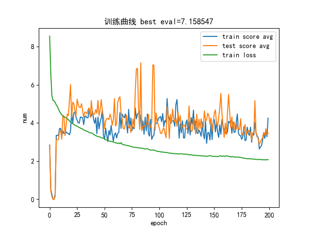
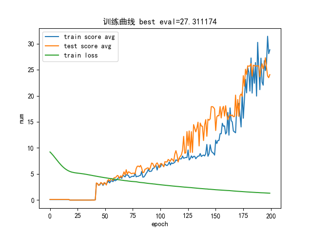
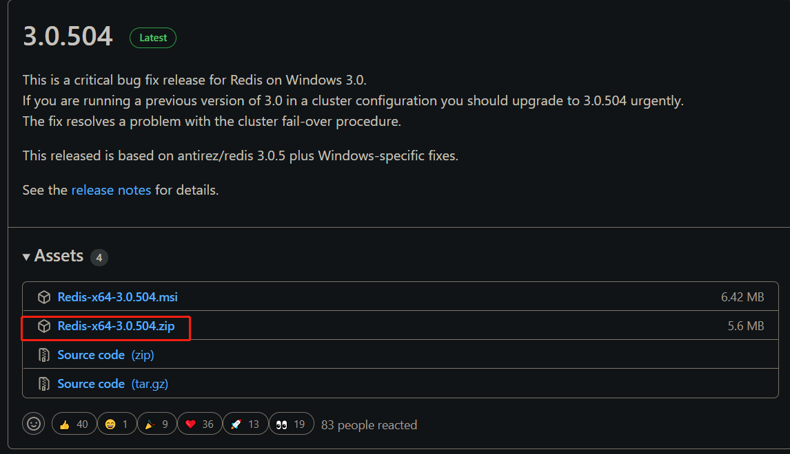
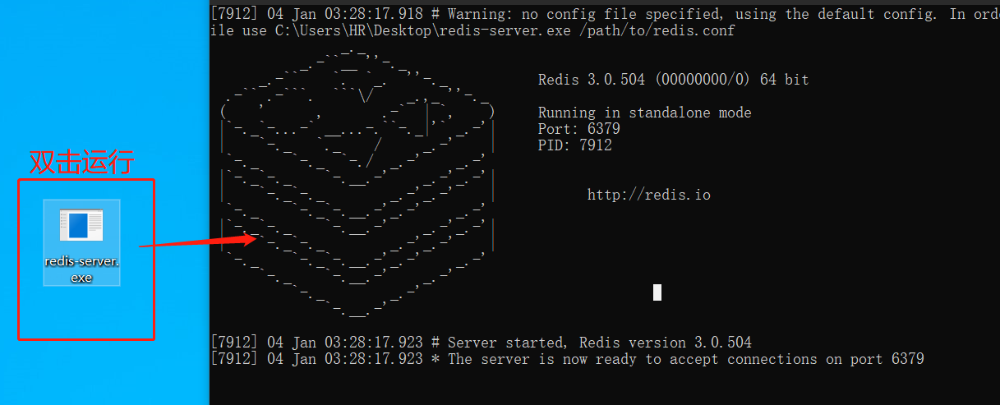

# 基于transformer的机器翻译任务

- [X]  实现baseline
- [X]  添加blue评价指标并输出训练结果 -22/1/3
- [X]  拆分数据从新训练 - 22/1/3
- [X]  添加redis测试 -22/1/4

# 一，项目介绍

数据来源：[网页中的英文翻译成中文zip](https://www.manythings.org/anki/)

使用外部模型：[大神开源的pytorch实现transformer](git@github.com:jadore801120/attention-is-all-you-need-pytorch.git)

## 1.原理

> 1. 使用transformer结构进行seq2seq的训练任务，本项目模仿任何语种的翻译，所以字表是自己生成的，只需要一点语言词粒度的基本知识就可以构造字表，由于笔记本GPU太小，模型大小和深度都缩减了，所以最后训练效果也一般般。
> 2. redis测试效果惊人，速度比没有redis快指数级，没用redis主要是bean search的解码花很多时间，序列模型都有这个解码耗时的特点。

## 2.结构

```bash
│  config.py
│  LICENSE
│  main.py  # 训练函数
│  predict.py  # 预测脚本，内涵redis使用测试
│  README.md
│  requirements.txt
|
├─data
│      cmn.txt  # 训练数据
│      vocab.txt  # 根据数据生成的字表
│
├─output
│  │  redis_download.png  # 使用的截图
│  │  redis_start.png
│  │
│  └─model
│          epoch_50.pth  # 测试用的模型，效果不好的主要原因是模型太浅，训练深度不够
│
├─src
│  │  evaluator.py  # 评估类
│  │  loader.py  # 数据加载类
│  │  __init__.py
│  
|
├─transformer  # 开源的transformer源码
│  │  Constants.py
│  │  Layers.py
│  │  Models.py
│  │  Modules.py
│  │  Optim.py
│  │  SubLayers.py
│  │  Translator.py
│  │  __init__.py │
```

## 3.数据展示

> 训练数据

```bash
Hi.	嗨。	CC-BY 2.0 (France) Attribution: tatoeba.org #538123 (CM) & #891077 (Martha)
Hi.	你好。	CC-BY 2.0 (France) Attribution: tatoeba.org #538123 (CM) & #4857568 (musclegirlxyp)
Run.	你用跑的。	CC-BY 2.0 (France) Attribution: tatoeba.org #4008918 (JSakuragi) & #3748344 (egg0073)
Wait!	等等！	CC-BY 2.0 (France) Attribution: tatoeba.org #1744314 (belgavox) & #4970122 (wzhd)
Wait!	等一下！	CC-BY 2.0 (France) Attribution: tatoeba.org #1744314 (belgavox) & #5092613 (mirrorvan)
Hello!	你好。	CC-BY 2.0 (France) Attribution: tatoeba.org #373330 (CK) & #4857568 (musclegirlxyp)
...
```

> 训练结果：lr=1e-2



> 训练结果：lr=1e-3
 



# 二，使用

环境

```bash
matplotlib==3.3.4
nltk==3.6.1
numpy==1.20.1
redis==4.1.0
torch==1.8.2+cu111
```

## 1.下载项目

`git clone git@github.com:eat-or-eat/seq2seq_cn2eng.git`

## 2.安装redis

> 下载redis

win10下载redis地址:[Releases · microsoftarchive/redis (github.com)](https://github.com/MicrosoftArchive/redis/releases)


> 文件拿出来，双击并打开



## 3.运行

### ①.训练（已经训练过了，不用训练了）

`python main.py`

打印示例：

```bash
2022-01-04 04:19:02,754 - __main__ - INFO - epoch 62 begin
2022-01-04 04:19:03,716 - __main__ - INFO - epoch average loss: 2.946986
2022-01-04 04:19:03,716 - __main__ - INFO - 开始测试第62轮模型效果：
---测试集---
输入： My father is out .
标签： 我父亲出门了。
输出： 我不是個好。
平均相似度： 0.039639382295646265
2022-01-04 04:19:04,363 - __main__ - INFO - 开始测试第62轮模型效果：
---训练集---
输入： We're special .
标签： 我们是特别的。
输出： 我們是一人。
平均相似度： 0.03211310063072272
```

### ②.redis预测测试

`python predict.py`

打印示例：

```bash
有redis，耗时： 0.062270164489746094
没有redis，耗时： 16.691434621810913
```
